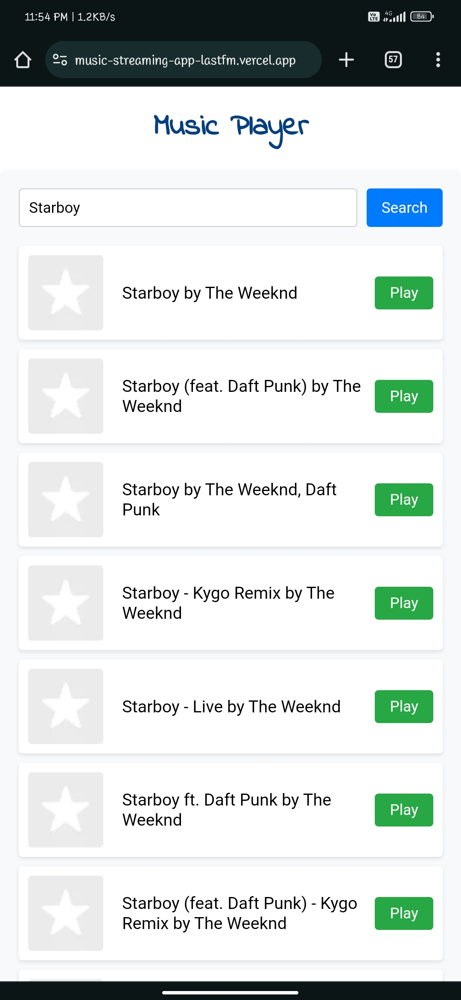

# Music Streaming Web App

A web-based music streaming application that allows users to play tracks, albums, and other data from the Last.fm API.

## Description

This project is a web-based music streaming application built using React.js. It allows users to search for music, play tracks, view album details, and enjoy a seamless music streaming experience.

## Features

- Search for songs, artists, and albums
- Play tracks directly from the application
- View album details and track information
- User-friendly interface for browsing and playing music

## Tech Stack

- Frontend: React.js
- API: Last.fm

##  Usage

- Enter a song, artist, or album name in the search bar and press Enter or click the Search button.
- Browse the search results and click the Play button next to a track to start playing it.
- Enjoy listening to your favorite music tracks!

## Screenshot

## Contributing

Contributions are welcome! If you find any bugs or have suggestions for new features, please open an issue or submit a pull request.

## License
This project is licensed under the MIT License.